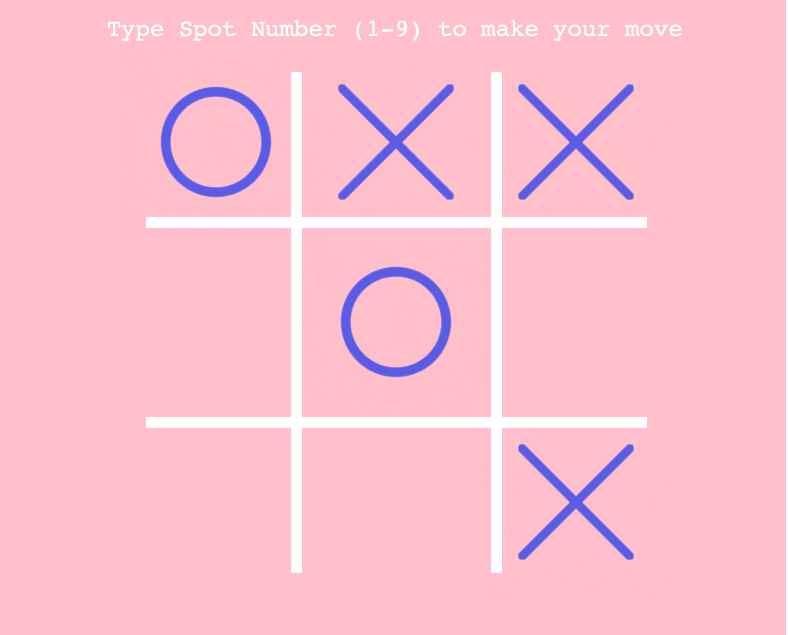

# tictactoe-pyturtle

tictactoe-pyturtle is a Python tic tac toe game using the [Turtle graphics framework](https://docs.python.org/3/library/turtle.html#:~:text=The%20turtle%20module%20is%20an,)%20100%25%20compatible%20with%20it.)
